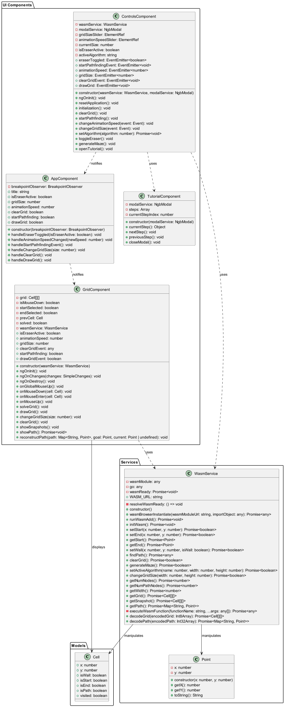

# Pathfinding Visualization

This program is composed of two parts, the Go code, pathfinding-algorithms, that handles all the logic, and the Angular
project, pathfinding-website, that uses WebAssembly and Angular to display the algorithm. This project was created to
showcase best practices and various design patterns. This project showed me that although I dislike JavaScript, I really
like TypeScript. I also realized how much more maintainable a program is when it is modular. Check out the sections
below for information about how everything works with some highlighted code and the UML.

View the live demo: https://djcurr.github.io/Pathfinding-Visualization/

## Table of Contents

- [Features](#features)
- [Pathfinding Algorithms](#pathfinding-algorithms)
  - [Main](#main)
  - [Pathfinder](#pathfinder)
  - [Algorithms](#algorithms)
  - [Data Structures](#data-structures)
  - [Models](#models)
  - [UML](#algorithms-uml)
- [Pathfinding Website](#pathfinding-website)
  - [Wasm Service](#wasm-service)
  - [Grid](#grid)
  - [Cell](#cell)
  - [Controls](#controls)
  - [Tutorial](#tutorial)
  - [App](#app)
  - [UML](#website-uml)

## Features

- Visualize pathfinding algorithms such as Dijkstra's algorithm and A*
- Object-Oriented Design
- Model-View-Controller Design
- Thorough error handling
- Easily extensible to new algorithms
- Responsive design
- Modular design
- Introductory tutorial
- Place walls and move the start and end nodes
- See snapshots of the pathfinding process

## Pathfinding Algorithms

Snapshots are taken at the end of each iteration of the algorithm, then retrieved by the UI. This was chosen instead of
only communicating changes for simplicity. More memory is used, but the entire active grid is just changed, with much
simpler programming.

### Main

Tha main package contains bindings for the Pathfinder to WASM/JS, these are all the functions the UI requires. This
utilizes the Model-View-Controller design pattern to encapsulate pathfinding logic from the UI. The pathfinder is
initialized when the website first launches, and stored as a pointer. The website can then call methods on the
pathfinder. Shared memory is used to communicate snapshots across languages.

Always just use the same snapshot pointer location in memory, but still return the current pointer to JS after encoding
the grid in a way we can decode it in JS. A similar method is used for the grid.

```go
package main

func getSnapshot() *[]uint8 {
	if snapshotPointer == nil || len(*snapshotPointer) != len(snapshot)*len(snapshot[0]) {
		ptr := make([]uint8, len(snapshot)*len(snapshot[0]))
		snapshotPointer = &ptr
	}
	encodeGrid(snapshot, *snapshotPointer)
	return snapshotPointer
}

```

The JS side (with error handling omitted), creates a new Int8 array at the pointer returned by getSnapshot. The grid is
then decoded.

```typescript
class WasmService {
    public async getSnapshot(): Promise<Cell[][]> {
        const {memory} = this.wasmModule.instance.exports;
        const gridPtr: number = await this.executeWasmFunction('getSnapshot')
        const grid = new Int8Array(memory.buffer, gridPtr + 16, numNodes);
        return this.decodeGrid(grid);
    }
}
```

Simplified encoding function. The node location is stored in its index of the array, then all parameters can be
expressed as a bit in a UInt8.

```go
package main

func encodeGrid(grid [][]*models.Node, encodedGrid []uint8) {
	for row := 0; row < len(grid); row++ {
		for col := 0; col < len(grid[0]); col++ {
			encodedNode := convertNodeToUint(*grid[row][col])
			encodedGrid[row*len(grid[0])+col] = encodedNode
		}
	}
}

func convertNodeToUint(node models.Node) uint8 {
	var boolPack uint8 = 0
	if node.Visited {
		boolPack |= 1 << 0 // Use bit 0 for Visited
	}
	if node.IsWall {
		boolPack |= 1 << 1 // Use bit 1 for IsWall
	}
	if node.IsStart {
		boolPack |= 1 << 2 // Use bit 2 for IsStart
	}
	if node.IsEnd {
		boolPack |= 1 << 3 // Use bit 3 for IsEnd
	}

	return boolPack
}

```

### Pathfinder

The Pathfinder provides functions for all requirements, such as

- Changing the algorithm
- Changing the start, end nodes, and size of the grid
- Drawing and erasing walls, clearing the grid
- Starting pathfinding and getting snapshots
- Generating mazes
- Retrieving information about nodes and the grid

Available algorithms are stored in a map to a function that returns a new instance of the algorithm. The currently
active algorithm is stored. All algorithm and grid logic is encapsulated in the pathfinder class.

```go
package pathfinder

type Pathfinder struct {
	algorithmsMap   map[Algorithm]func() algorithms.PathfindingAlgorithm
	activeAlgorithm algorithms.PathfindingAlgorithm
}

// NewPathfinder creates a new Pathfinder instance
func NewPathfinder() *Pathfinder {
	return &Pathfinder{
		algorithmsMap: map[Algorithm]func() algorithms.PathfindingAlgorithm{
			aStar: func() algorithms.PathfindingAlgorithm {
				return &algorithms.AStar{}
			},
			dijkstra: func() algorithms.PathfindingAlgorithm {
				return &algorithms.Dijkstra{}
			},
		},
	}
}
```

Maze generation is done using recursive Depth-First Search. This is a simple way to generate a typical maze.

```go
package pathfinder

func (p *Pathfinder) generateMaze(maze [][]*models.Node, x, y int) error {
	directions := []models.Point{
		{0, -1},
		{-1, 0}, {1, 0},
		{0, 1},
	}
	// Mark the current cell as visited

	maze[y][x].IsWall = false
	maze[y][x].Visited = true

	// Randomly order the directions
	rand.Shuffle(len(directions), func(i, j int) {
		directions[i], directions[j] = directions[j], directions[i]
	})

	// Explore the neighbors in a random order
	for _, d := range directions {
		nx, ny := x+2*d.Dx, y+2*d.Dy

		// Check bounds and if the neighbor has been visited
		if nx >= 0 && nx < len(maze[0]) && ny >= 0 && ny < len(maze) && !maze[ny][nx].Visited {
			maze[(y+ny)/2][(x+nx)/2].IsWall = false
			if err := p.generateMaze(maze, nx, ny); err != nil {
				return err
			} // Recursively visit the neighbor
		}
	}
	return nil
}

```

### Algorithms

A PathfindingAlgorithm interface is provided that includes all functions shared by pathfinding algorithms. The
pathfinding algorithm interface allows for polymorphism of the algorithms and for new ones to be added easily. New
Pathfinding algorithms are just required to implement the PathfindingAlgorithm interface.

Common requirements implemented by the pathfinding algorithms interface are:

- Initialization and clearing of the pathfinding algorithm and grid
- Starting pathfinding and getting the grid and snapshots
- Setting and getting information about the grid (start, end, walls, etc.)

```go
package algorithms

type PathfindingAlgorithm interface {
	Init(width, height int) error
	Clear() error
	FindPath() error
	GetGrid() (*models.Grid, error)
	GetSnapshot() ([][]*models.Node, error)
	GetPath() (map[models.Node]models.Node, error)
	SetStart(x, y int) error
	SetEnd(x, y int) error
	SetWall(x, y int, visited bool) error
	GetStart() (node *models.Node, err error)
	GetEnd() (node *models.Node, err error)
}
```

#### A*

A* has the typical implementation along with snapshots. Simplified version here:

```go
package algorithms

func (a *AStar) FindPath() error {
	// Pseudocode:
	// 1. Initialize open and closed lists
	// 2. Add the start node to the open list
	// 3. Loop until the open list is empty or the end node is reached
	//    a. Find the node with the lowest f score in the open list (current node)
	//    b. Remove current node from the open list and add it to the closed list
	//    c. For each neighbor of the current node:
	//       i. If neighbor is not traversable or in the closed list, skip to the next neighbor
	//       ii. If new path to neighbor is shorter OR neighbor is not in open list:
	//           - Set f, g, and h scores of the neighbor
	//           - Set parent of neighbor to current
	//           - If neighbor not in open list, add it
	// 4. Once the end node is reached, backtrack from the end node to start node to get the path
	startNode, err := a.grid.GetStart()
	endNode, err := a.grid.GetEnd()
	heap.Push(a.openSet, datastructures.NewItem(startNode, 0))
	a.gScore[startNode] = 0
	a.fScore[startNode] = heuristic(startNode, endNode)

	for a.openSet.Len() > 0 {
		current := heap.Pop(a.openSet).(*datastructures.Item).GetNode()
		if current.IsEnd {
			a.solved = true
			return nil
		}

		a.closedSet[current] = true
		if !current.IsStart && !current.IsEnd {
			current.Visited = true
		}

		neighbors, err := a.grid.GetNeighbors(current)

		for _, neighbor := range neighbors {
			if a.closedSet[neighbor] || neighbor.IsWall {
				continue
			}

			tentativeGScore := a.gScore[current] + distBetween(current, neighbor)
			if tentativeGScore >= a.gScore[neighbor] && a.gScore[neighbor] != 0 {
				continue
			}

			// This path is the best until now. Record it!
			a.path[*neighbor] = *current
			a.gScore[neighbor] = tentativeGScore
			a.fScore[neighbor] = a.gScore[neighbor] + heuristic(neighbor, endNode)
			if !a.openSet.Contains(neighbor) {
				heap.Push(a.openSet, datastructures.NewItem(neighbor, a.fScore[neighbor]))
			} else {
				a.openSet.Update(neighbor, a.fScore[neighbor])
			}
		}
		// Take a snapshot
		snapshot, err := a.grid.DeepCopy()
		a.snapshots.Enqueue(snapshot.GetNodes())

	}
	a.solved = true
}
```

#### Dijkstra

Dijkstra uses the typical implementation as well, including snapshots:

```go
package algorithms

func (d *Dijkstra) FindPath() error {
	startNode, err := d.grid.GetStart()

	d.distances[startNode] = 0
	heap.Push(d.openSet, datastructures.NewItem(startNode, 0))

	for d.openSet.Len() > 0 {
		current := heap.Pop(d.openSet).(*datastructures.Item).GetNode()

		if current.IsEnd {
			d.solved = true
			return nil
		}

		if !current.IsStart && !current.IsEnd {
			current.Visited = true
		}

		neighbors, err := d.grid.GetNeighbors(current)
		for _, neighbor := range neighbors {
			if neighbor.Visited || neighbor.IsWall {
				continue
			}

			tentativeDistance := d.distances[current] + distBetween(current, neighbor)
			if dist, exists := d.distances[neighbor]; !exists || tentativeDistance < dist {
				d.distances[neighbor] = tentativeDistance
				d.path[*neighbor] = *current
				if !d.openSet.Contains(neighbor) {
					heap.Push(d.openSet, datastructures.NewItem(neighbor, tentativeDistance))
				} else {
					d.openSet.Update(neighbor, tentativeDistance)
				}
			}
		}

		snapshot, err := d.grid.DeepCopy()
		d.snapshots.Enqueue(snapshot.GetNodes())
	}
	d.solved = true
}
```

### Data Structures

Queue is implemented as an array, PriorityQueue uses a Heap as specified by the Go Docs.

### Models

#### Node

A Node is the smallest component, it can have a location and parameters such as visited, wall, start, etc.

#### Grid

A grid is a collection of nodes. It encapsulates the functionality of a grid by providing functions for:

- Initializing the grid
- Setting and getting information about the grid such as start and end nodes, dimensions
- Helpers such as getting neighbors and creating a snapshot

### Algorithms UML


## Pathfinding Website

Some of the main goals of the pathfinding website were to be responsive, fast, error-tolerant, and modular.

### Wasm Service

The Wasm Service provides bindings for the Go main functions and is injectable into components. This instantiates Wasm,
translates objects between Go and JS, and allows for communication with the pathfinder.

### Cell

The simplest component of the UI is the cell, which just has properties of the cell, such as visited, wall, start, end
status, etc.

### Grid

The grid is simply a collection of cells arranged in columns and rows.

```html

<div class="container-fluid">
    <div class="row">
        <div class="col-12 grid" (mouseup)="onMouseUp()">
            <div *ngFor="let row of grid" class="row">
                <div *ngFor="let cell of row" class="cell" [class.wall]="cell.isWall" [class.start]="cell.isStart"
                     [class.end]="cell.isEnd" [class.path]="cell.isPath" [class.visited]="cell.visited"
                     (mousedown)="onMouseDown(cell)" (mouseenter)="onMouseEnter(cell)">
                </div>
            </div>
        </div>
    </div>
</div>
```

The grid receives events from the controls component, handles dragging to draw, moving the start and end nodes, drawing
and modifying the grid, and showing snapshots and the path.

```typescript
class GridComponent {
    @Input() isEraserActive: boolean = false;
    @Input() animationSpeed: number = DefaultAnimationSpeed;
    @Input() gridSize: number = DefaultGridSize;
    @Input() clearGridEvent!: any;
    @Input() startPathfinding!: boolean;
    @Input() drawGridEvent!: boolean;
}
```

### Controls

The controls component emits events to notify other components and ViewChild's to get the state of elements.

```typescript
class ControlsComponent {
    @Output() eraserToggled = new EventEmitter<boolean>();
    @Output() startPathfindingEvent = new EventEmitter<void>();
    @Output() animationSpeed = new EventEmitter<number>();
    @Output() gridSize = new EventEmitter<number>();
    @Output() clearGridEvent = new EventEmitter<void>();
    @Output() drawGrid = new EventEmitter<void>();
    @ViewChild('gridSizeSlider') gridSizeSlider: ElementRef | undefined;
    @ViewChild('animationSpeedSlider') animationSpeedSlider: ElementRef | undefined;
}
```

### Tutorial

I created the tutorial component because although I felt the website was intuitive, I thought a guide would be useful
when visiting to showcase the features. I didn't want to mess with my clean layout, so I implemented a tutorial in the form of a modal with different steps and gifs depicting how to use the tools. Each step is stored in an array with a title, link, and description to easily swap the content in the modal.

### App

The App component transmits events to modules that request them. The App component also detects changes in screen size
and sets the grid size.

```typescript
class GridComponent {
  constructor(private breakpointObserver: BreakpointObserver) {
    this.breakpointObserver.observe([
      Breakpoints.XSmall,
      Breakpoints.Small
    ]).subscribe(result => {
      if (result.matches) {
        if (result.breakpoints[Breakpoints.XSmall] || result.breakpoints[Breakpoints.Small]) {
          this.gridSize = 13;
          DefaultGridSize = 13;
        }
      }
    });
  }
}
```

### Website UML
